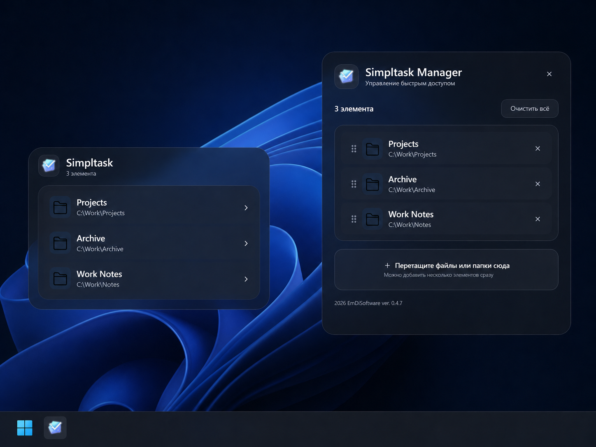

# Simpltask

[](https://github.com/AdamAnomatik/Simpltask-Releases/releases/latest)
[](https://github.com/AdamAnomatik/Simpltask-Releases/releases)
[](https://github.com/AdamAnomatik/Simpltask-Releases/releases/latest)

**Русский** · [English](README.en.md)

<p align="center">
  
</p>

**Simpltask** — компактная Windows-утилита для быстрого доступа к часто используемым файлам и папкам прямо с панели задач.

## Возможности

- Быстрый доступ к файлам и папкам из компактного Launcher.
- Добавление элементов через Simpltask Manager.
- Перетаскивание файлов и папок мышью.
- Изменение порядка элементов.
- Глобальная настраиваемая горячая клавиша.
- Светлая, тёмная и системная темы.
- Настройка прозрачности Launcher, Manager и окна настроек.
- Выбор языка интерфейса: **Системный**, **Русский** или **English**.
- Поддержка нескольких мониторов.
- Сохранение списка элементов и пользовательских настроек между обновлениями.

## Скачать

Последняя стабильная версия доступна в разделе **Releases**.

➡️ **[Скачать последнюю версию Simpltask](https://github.com/AdamAnomatik/Simpltask-Releases/releases/latest)**

### Что скачать

- `Simpltask-Setup-x.y.z.exe` — установщик приложения.
- `Simpltask-Setup-x.y.z.sha256.txt` — контрольная сумма SHA-256 для проверки загруженного файла.

## Системные требования

- 64-разрядная Windows 11.
- Закрепление приложения на панели задач выполняется один раз после установки.

## Установка

1. Скачайте последний файл `Simpltask-Setup-x.y.z.exe`.
2. Запустите установщик.
3. После первого запуска закрепите Simpltask на панели задач.
4. Нажмите закреплённый значок, чтобы открыть Launcher.

## Обновление

Новый установщик можно запускать поверх предыдущей версии.

Список элементов и пользовательские настройки сохраняются.

## Где хранятся данные

Пользовательские данные хранятся локально:

```text
%LOCALAPPDATA%\Simpltask
```

Simpltask не требует учётной записи и не отправляет список ваших файлов и папок на удалённый сервер.

## Проверка SHA-256

После загрузки установщика можно проверить его контрольную сумму в PowerShell:

```powershell
Get-FileHash .\Simpltask-Setup-x.y.z.exe -Algorithm SHA256
```

Полученное значение должно совпадать с опубликованным файлом `Simpltask-Setup-x.y.z.sha256.txt`.

## Сообщить об ошибке

Обнаружили проблему или хотите предложить улучшение?

➡️ **[Создать обращение](https://github.com/AdamAnomatik/Simpltask-Releases/issues/new/choose)**

При описании ошибки укажите:

- версию Simpltask;
- версию Windows;
- шаги для воспроизведения;
- скриншот, если он помогает понять проблему.


